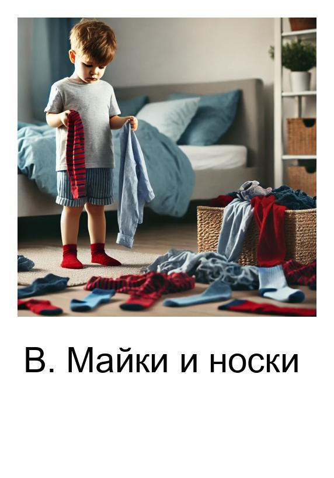
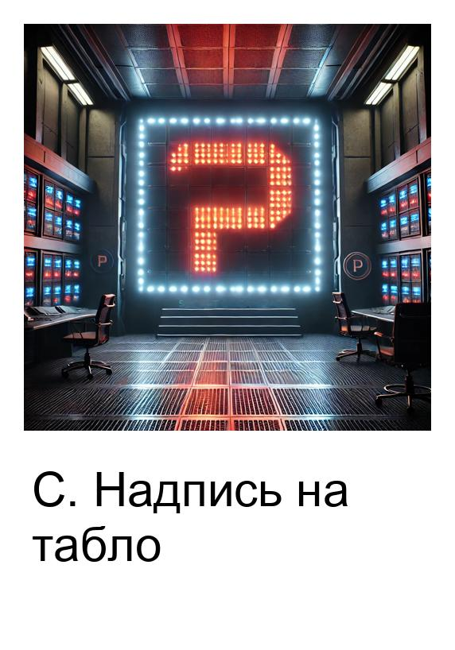
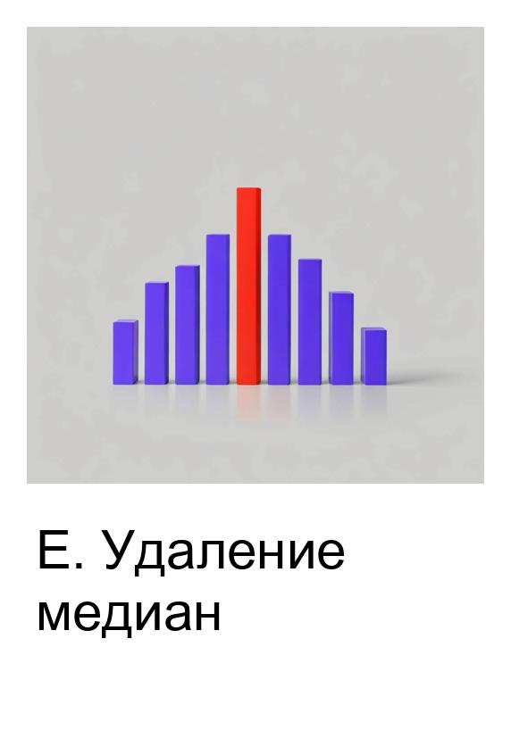
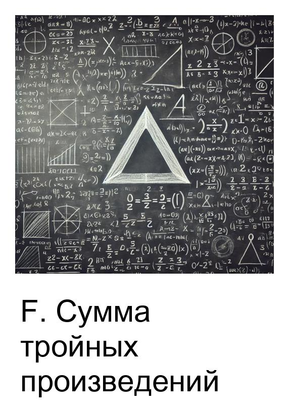
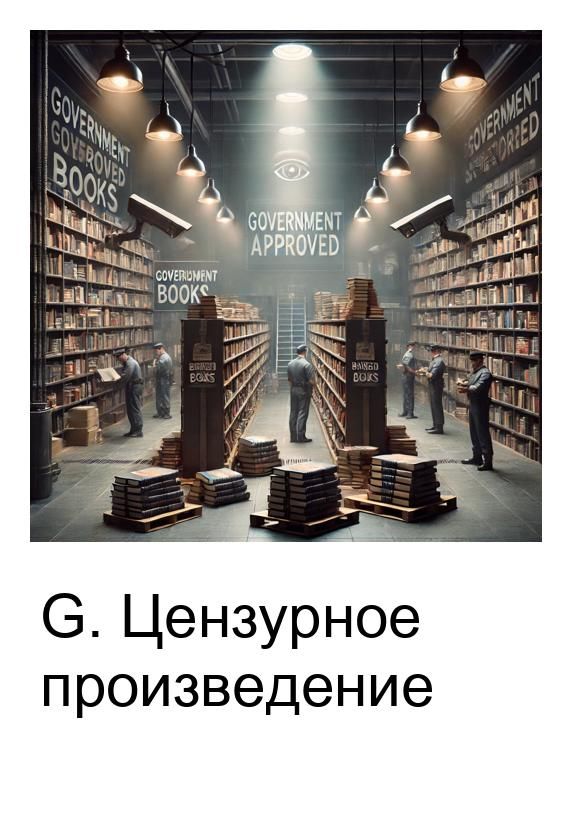
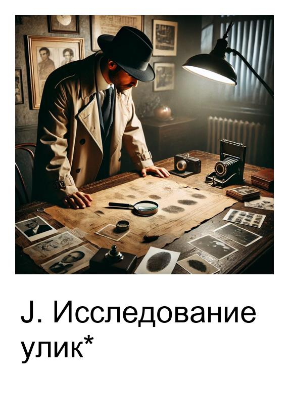
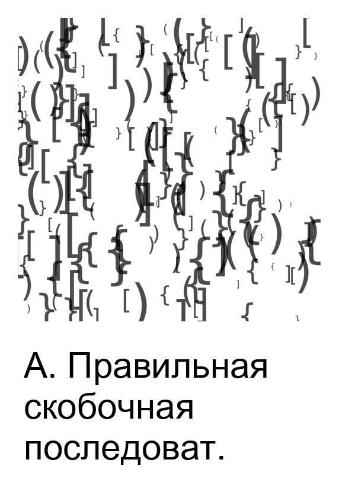
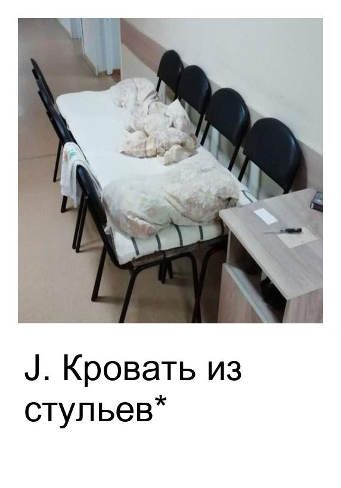

# Тренировки по алгоритмам 6.0 от Яндекса

Здесь собраны решения домашних заданий с тренировок по алгоритмам 6.0 от Яндекса, всего решено 34/35 задач. Все делалось на питоне, поэтому для удобства решения хранятся в виде ноутбуков. Условия задач и подробности тренировок 6.0 - [по ссылке](https://yandex.ru/yaintern/training/algorithm-training).

Для упрощения ввода использовалась кастомная функция `input()`, реализованная в модуле [utils/string_input.py](utils/string_input.py).

<details>
<summary>&nbsp;Подробнее про <code>input()</code></summary>
<blockquote></blockquote>
<blockquote>
    
Неудобно каждый раз вводить данные для тестов вручную с клавиатуры, особенно если они состоят из кучи длинных строк. Читать из файла тоже неудобно, потому что для этого надо в отдельном окне/вкладке держать еще и этот файл, нажимая <kbd>ctrl</kbd>+<kbd>s</kbd> каждый раз, когда в нем что-то поменяется.

Поэтому и был реализован кастомный `input()`. Он работает точно так же, как и встроенный, но читает не из стандартного ввода с клавиатуры, а из специальной строковой переменной. Соответственно, прежде чем считывать оттуда, необходимо записать в эту строковую переменную нужные строки с помощью `set_input()`. Например:
```Python
# Пишем сюда входные данные
set_input("""
5
1 2 3 4 5
""")

# Считываем их, как будто их вводят с клавиатуры
n = int(input())
array = list(map(int, input().split()))
```

В итоге можно через `set_input()` вставлять любые входные данные, а потом считывать их с помощью `input()`, как будто они вводятся с клавиатуры. Если все входные данные прочитаны из строки (или если они и вовсе не были туда записаны), `input()` работает в штатном режиме, считывая с клавиатуры.

P.S. Можно было сделать это и через перенаправление потока ввода, но в Jupyter ввод устроен иначе, и это так просто не сработает.

</blockquote>
</details>

## Список задач

### Занятие 1. Тестирование

<a href="homework_1.ipynb"></a>
<a href="homework_1.ipynb"></a>
<a href="homework_1.ipynb"></a>
<a href="homework_1.ipynb"></a>
<a href="homework_1.ipynb"></a>

### Занятие 2. Префиксные суммы и два указателя

<a href="homework_2.ipynb"></a>
<a href="homework_2.ipynb"></a>
<a href="homework_2.ipynb"></a>
<a href="homework_2.ipynb"></a>
<a href="homework_2.ipynb"></a>
<a href="homework_2.ipynb"></a>
<a href="homework_2.ipynb"></a>
<a href="homework_2.ipynb"></a>
<a href="homework_2.ipynb"></a>
<a href="homework_2.ipynb"></a>

### Занятие 3. Стеки, очереди, деки

<a href="homework_3.ipynb"></a>
<a href="homework_3.ipynb"></a>
<a href="homework_3.ipynb"></a>
<a href="homework_3.ipynb"></a>
<a href="homework_3.ipynb"></a>
<a href="homework_3.ipynb"></a>
<a href="homework_3.ipynb"></a>
<a href="homework_3.ipynb"></a>
<a href="homework_3.ipynb"></a>
<a href="homework_3.ipynb"></a>

### Занятие 4. Деревья, представления и обходы

<a href="homework_4.ipynb"></a>
<a href="homework_4.ipynb"></a>
<a href="homework_4.ipynb"></a>
<a href="homework_4.ipynb"></a>
<a href="homework_4.ipynb"></a>
<a href="homework_4.ipynb"></a>
<a href="homework_4.ipynb"></a>
<a href="homework_4.ipynb"></a>
<a href="homework_4.ipynb"></a>
<a href="homework_4.ipynb"></a>